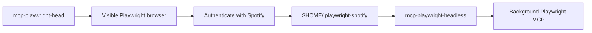

# MCPs Launcher

A small macOS/zsh launcher for the existing Chrome and Playwright MCP tunnels.
It adds explicit visible and background Playwright modes while preserving the
same persistent browser profile between them.

## Why two Playwright modes?

Spotify authentication needs a visible browser. Normal MCP use is usually more
convenient in the background. Both commands point Playwright at
`$HOME/.playwright-spotify`, so the browser state created during a visible
login is reused later:



The browser profile is local runtime data. It is never copied into this
repository.

## Requirements

- macOS with zsh
- `tunnel-client` installed at `/usr/local/bin/tunnel-client`, or
  `TUNNEL_CLIENT_BIN` pointing to it
- existing tunnel-client profiles named `chrome-browser-mcp` and `playwright`
- Node.js with `npx` available to tunnel-client
- the Chrome Browser MCP extension/native bridge for Chrome commands

## Install

```zsh
./install.sh
```

The installer writes to `$HOME/.local/bin` by default. It creates timestamped
backups before replacing conflicting files or links and does not modify
`.zshrc` or any tunnel profile.

To test an isolated installation directory:

```zsh
MCP_LAUNCHER_INSTALL_BIN_DIR=/tmp/mcps-bin ./install.sh
```

## Authenticate Spotify

Start Playwright with a visible browser:

```zsh
mcp-playwright-head
```

Open Spotify in that Playwright browser and sign in yourself. Do not put
credentials in this repository or launcher configuration. When authentication
is complete, switch to the background mode:

```zsh
mcp-playwright-headless
```

Starting the opposite mode automatically stops the currently running
Playwright tunnel before starting its replacement. Only one Playwright tunnel
is allowed at a time.

## Commands

```zsh
mcps                         # interactive menu; starts nothing by itself
mcp-chrome                   # Chrome MCP only
mcp-playwright-head          # Playwright with a visible browser
mcp-playwright-headless      # Playwright in the background
mcp-playwright               # backward-compatible headless alias
mcps both                    # Chrome + headless Playwright

mcps status
mcps stop chrome
mcps stop playwright
mcps stop both

mcps restart chrome
mcps restart playwright-head
mcps restart playwright-headless
mcps restart both

mcps logs chrome
mcps logs playwright
```

Status distinguishes the active Playwright mode:

```text
Chrome MCP: stopped
Playwright MCP: running (headed, PID 12345)
```

## Runtime files

The launcher stores operator state under
`$HOME/.local/state/mcp-launcher/`:

- `chrome.pid` and `playwright.pid`
- `chrome.log` and `playwright.log`
- per-process health URL files
- `playwright.mode`

Tunnel configuration remains under `$HOME/.config/tunnel-client/`. The
persistent Playwright browser profile remains at `$HOME/.playwright-spotify`.
None of these machine-specific files belong in Git.

## Validation

Run the complete dependency-free check:

```zsh
zsh scripts/check.zsh
```

This checks zsh syntax, launcher lifecycle, mode switching, duplicate
prevention, Chrome regression behavior, installer backups/idempotency,
repository hygiene, and whitespace errors.

## Troubleshooting

### A command is not found

Confirm `$HOME/.local/bin` is already on `PATH`:

```zsh
print -r -- $path
```

The installer deliberately does not edit shell configuration.

### Chrome MCP is not ready

Open Google Chrome and enable the Chrome Browser MCP extension. The local
bridge must listen on `127.0.0.1:2091` before its tunnel starts.

### Playwright fails to start

Inspect:

```zsh
mcps status
mcps logs playwright
tunnel-client doctor --profile playwright --explain
```

The launcher removes only `CONTROL_PLANE_TUNNEL_ID` from the child environment
so an ambient override cannot replace the tunnel ID stored in the selected
profile. It never prints configuration values.

### Spotify asks for login again

Stop Playwright, run `mcp-playwright-head`, and confirm the visible browser was
started with the expected local profile. Authenticate there, then run
`mcp-playwright-headless` again.
